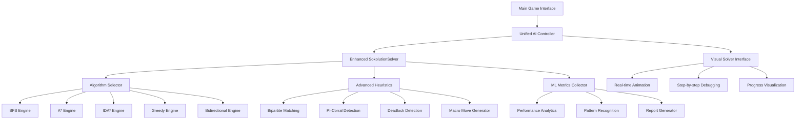
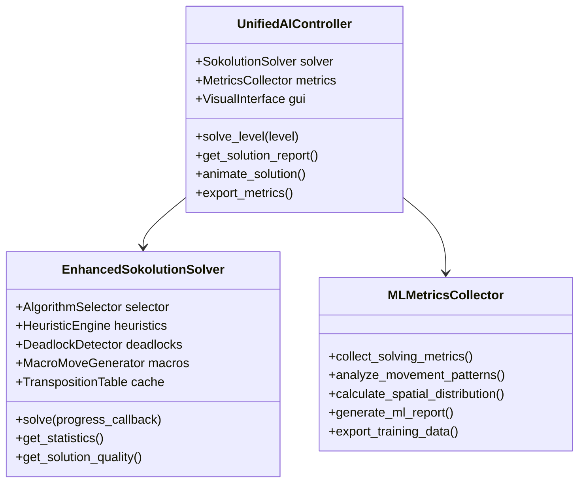
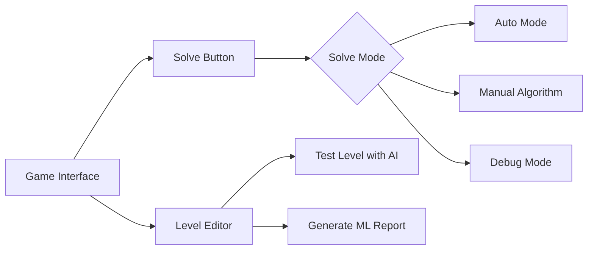
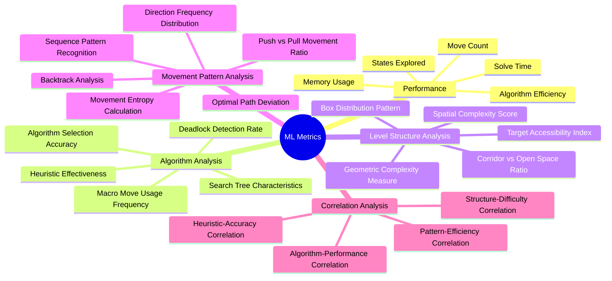

# 🤖 Plan de Refactoring du Système IA Sokoban

## 📋 Vue d'Ensemble du Projet

### 🎯 Objectifs Principaux
1. **Consolidation** : Unifier tout le code IA dispersé vers un SokolutionSolver central
2. **Optimisation** : Implémenter les meilleures techniques du solver Sokolution original
3. **Interface** : Connexion fluide avec l'interface graphique existante
4. **Intelligence** : Système de rapports ML avec métriques avancées
5. **Distribution** : Package Python et exécutables Windows/Linux

### 🔍 Analyse de l'État Actuel

**Code IA Dispersé Identifié :**
- `src/core/auto_solver.py` - Contrôleur principal avec sélection adaptative
- `src/generation/sokolution_solver.py` - Implémentation Sokolution avancée
- `src/generation/advanced_solver.py` - Solver A* sophistiqué
- `src/generation/expert_solver.py` - Solver IDA* expert
- `src/generation/level_solver.py` - Solver BFS basique

**Problèmes Identifiés :**
- Code dupliqué entre différents solvers
- Logique de sélection d'algorithme dispersée
- Métriques ML inexistantes
- Interface graphique non optimisée pour l'IA

## 🏗️ Architecture Proposée



## 🚀 Plan d'Implémentation Détaillé

### **Phase 1 : Audit et Nettoyage (Jour 1-2)**

#### 1.1 Analyse du Code Existant
- **Objectif** : Cartographier tous les fichiers liés à l'IA
- **Actions** :
  - Identifier les doublons et redondances
  - Évaluer les performances actuelles
  - Documenter les dépendances

#### 1.2 Architecture de Consolidation



### **Phase 2 : SokolutionSolver Amélioré (Jour 3-5)**

#### 2.1 Implémentation des Algorithmes Core

**Algorithmes à Intégrer :**
- **BFS** : Pour niveaux simples (< 50 complexité)
- **A*** : Pour niveaux moyens (50-150 complexité)
- **IDA*** : Pour niveaux complexes (150-300 complexité)
- **Greedy** : Pour recherche rapide non-optimale
- **Bidirectionnel** : Pour niveaux très complexes (> 300 complexité)

**Structure de Code :**
```python
class EnhancedSokolutionSolver:
    def __init__(self, level):
        self.level = level
        self.algorithm_selector = AlgorithmSelector()
        self.heuristics = AdvancedHeuristics(level)
        self.deadlock_detector = EnhancedDeadlockDetector(level)
        self.macro_generator = MacroMoveGenerator(level)
        self.metrics_collector = SolvingMetricsCollector()
        
    def solve(self, progress_callback=None):
        """Point d'entrée principal pour la résolution"""
        algorithm = self.algorithm_selector.select_optimal(self.level)
        return self._execute_algorithm(algorithm, progress_callback)
```

#### 2.2 Heuristiques Avancées (inspirées de source_page.html)

**Techniques de Sokolution à Implémenter :**

1. **Bipartite Matching Hongrois (O(n³))**
```python
class BipartiteMatchingHeuristic:
    def calculate_hungarian_assignment(self, boxes, targets):
        """Algorithme Hongrois optimisé pour assignment boxes-targets"""
        # Implémentation O(n³) vs O(n⁴) original
```

2. **PI-Corral Detection**
```python
class PICorralDetector:
    def find_all_corrals(self, state):
        """Détection des corrals simples et combinés"""
        # - Corrals simples
        # - Corrals combinés de deux corrals simples  
        # - Corrals avec zones non-atteignables par le joueur
```

3. **Goal Room Analysis**
```python
class GoalRoomAnalyzer:
    def identify_goal_rooms(self, level):
        """Identifie les salles d'objectifs avec entrée unique"""
        # Analyse topologique des zones de targets
```

4. **Macro Move Generation**
```python
class MacroMoveGenerator:
    def generate_macro_moves(self, state):
        """Génère les macro-mouvements selon Sokolution"""
        # - Macro Tunnel (passages étroits)
        # - Macro Goal (salles d'objectifs)
        # - Macro Goal Cut (ordering partiel)
```

#### 2.3 Système de Sélection Automatique d'Algorithme

```python
class AlgorithmSelector:
    def __init__(self):
        self.complexity_thresholds = {
            'simple': 50,      # BFS
            'medium': 150,     # A*
            'complex': 300,    # IDA*
            'expert': float('inf')  # Bidirectional Greedy
        }
    
    def calculate_complexity_score(self, level):
        """Calcul sophistiqué de la complexité du niveau"""
        base_score = level.width * level.height * 0.5
        box_penalty = len(level.boxes) * 15
        target_penalty = len(level.targets) * 10
        
        # Pénalités additionnelles pour niveaux complexes
        if len(level.boxes) > 5 and (level.width * level.height) > 150:
            base_score *= 1.5
            
        return base_score + box_penalty + target_penalty
    
    def select_optimal_algorithm(self, level):
        """Sélection automatique de l'algorithme optimal"""
        complexity = self.calculate_complexity_score(level)
        
        if complexity < self.complexity_thresholds['simple']:
            return Algorithm.BFS
        elif complexity < self.complexity_thresholds['medium']:
            return Algorithm.ASTAR
        elif complexity < self.complexity_thresholds['complex']:
            return Algorithm.IDA_STAR
        else:
            return Algorithm.BIDIRECTIONAL_GREEDY
```

### **Phase 3 : Interface Visuelle Intégrée (Jour 6-7)**

#### 3.1 Intégration GUI Existante

**Points de Connexion Identifiés :**
- `src/gui_main.py` - Interface principale du jeu
- `src/editors/enhanced_level_editor.py` - Éditeur de niveaux
- `src/renderers/gui_renderer.py` - Système de rendu

**Boutons d'IA à Ajouter :**


#### 3.2 Animation en Temps Réel

```python
class VisualAISolver:
    def __init__(self, renderer, skin_manager):
        self.renderer = renderer
        self.skin_manager = skin_manager
        self.animation_speed = 400  # ms entre mouvements
        
    def animate_solution(self, solution, level):
        """Anime la solution étape par étape"""
        for i, move in enumerate(solution):
            # Exécuter le mouvement
            level.move(*self._parse_move(move))
            
            # Rendre l'état actuel
            self._render_current_state(level)
            
            # Afficher les informations de progression
            self._show_progress_info(i, len(solution), move)
            
            # Attendre avant le prochain mouvement
            pygame.time.wait(self.animation_speed)
```

#### 3.3 Interface de Debug et Analyse

```python
class AIDebugInterface:
    def show_algorithm_selection_reasoning(self, level, selected_algorithm):
        """Affiche pourquoi un algorithme a été sélectionné"""
        
    def visualize_search_progress(self, states_explored, current_state):
        """Visualise la progression de la recherche"""
        
    def show_deadlock_detection(self, detected_deadlocks):
        """Affiche les deadlocks détectés"""
        
    def display_heuristic_values(self, state, heuristic_breakdown):
        """Affiche la décomposition des valeurs heuristiques"""
```

### **Phase 4 : Système ML et Métriques (Jour 8-9)**

#### 4.1 Collection de Métriques Complètes

```python
class MLMetricsCollector:
    def __init__(self):
        self.metrics_data = {
            'basic_metrics': {},
            'advanced_metrics': {},
            'level_correlation': {},
            'algorithm_performance': {}
        }
    
    def collect_solving_metrics(self, level, solution_data, algorithm_stats):
        """Collection complète de toutes les métriques"""
        return {
            'basic_metrics': {
                'moves_count': len(solution_data.moves),
                'solve_time': solution_data.time_taken,
                'states_explored': algorithm_stats.states_explored,
                'states_generated': algorithm_stats.states_generated,
                'algorithm_used': algorithm_stats.algorithm_name,
                'deadlocks_pruned': algorithm_stats.deadlocks_pruned,
                'memory_peak': algorithm_stats.memory_usage_peak
            },
            'advanced_metrics': {
                'movement_patterns': self._analyze_movement_patterns(solution_data.moves),
                'spatial_distribution': self._calculate_spatial_distribution(level),
                'deadlock_patterns': self._extract_deadlock_patterns(algorithm_stats),
                'macro_moves_used': self._count_macro_moves(solution_data.moves),
                'heuristic_efficiency': self._measure_heuristic_performance(algorithm_stats),
                'search_tree_depth': algorithm_stats.max_depth_reached,
                'branching_factor': algorithm_stats.average_branching_factor
            },
            'level_correlation': {
                'level_structure_complexity': self._analyze_level_topology(level),
                'box_target_distribution': self._measure_spatial_entropy(level),
                'corridor_tunnel_ratio': self._calculate_space_ratios(level),
                'connectivity_graph': self._build_connectivity_graph(level),
                'bottleneck_analysis': self._identify_bottlenecks(level)
            },
            'algorithm_performance': {
                'convergence_rate': algorithm_stats.convergence_metrics,
                'pruning_effectiveness': algorithm_stats.pruning_stats,
                'heuristic_accuracy': algorithm_stats.heuristic_accuracy,
                'cache_hit_ratio': algorithm_stats.cache_performance
            }
        }
```

#### 4.2 Analyse des Patterns de Mouvement

```python
class MovementPatternAnalyzer:
    def analyze_movement_patterns(self, moves):
        """Analyse sophistiquée des patterns de mouvement"""
        return {
            'direction_frequency': self._count_directions(moves),
            'sequence_patterns': self._find_recurring_sequences(moves),
            'backtrack_analysis': self._analyze_backtracks(moves),
            'push_pull_ratio': self._calculate_push_pull_ratio(moves),
            'optimal_path_deviation': self._measure_optimality(moves),
            'movement_entropy': self._calculate_movement_entropy(moves)
        }
    
    def calculate_spatial_distribution(self, level):
        """Analyse de la distribution spatiale du niveau"""
        return {
            'box_clustering': self._measure_box_clustering(level.boxes),
            'target_dispersion': self._measure_target_dispersion(level.targets),
            'free_space_ratio': self._calculate_free_space_ratio(level),
            'geometric_complexity': self._assess_geometric_complexity(level),
            'symmetry_analysis': self._analyze_symmetries(level)
        }
```

#### 4.3 Générateur de Rapports ML

```python
class MLReportGenerator:
    def generate_comprehensive_report(self, level, solution_data, metrics):
        """Génère un rapport ML complet en JSON et HTML"""
        report = {
            'timestamp': datetime.now().isoformat(),
            'level_info': self._extract_level_info(level),
            'solution_summary': self._create_solution_summary(solution_data),
            'performance_metrics': metrics,
            'ml_features': self._extract_ml_features(level, solution_data),
            'recommendations': self._generate_recommendations(metrics)
        }
        
        # Export multiple formats
        self._export_json_report(report)
        self._export_html_report(report)
        self._export_csv_features(report['ml_features'])
        
        return report
    
    def export_training_data(self, multiple_solutions):
        """Exporte les données pour entraîner des modèles ML"""
        training_data = []
        for solution in multiple_solutions:
            features = self._extract_features_vector(solution)
            labels = self._extract_target_variables(solution)
            training_data.append({'features': features, 'labels': labels})
        
        # Export en format ML standard
        self._export_sklearn_format(training_data)
        self._export_tensorflow_format(training_data)
        
    def visualize_performance_analytics(self, metrics_history):
        """Crée des visualisations de performance"""
        # Graphiques de performance dans le temps
        # Comparaisons d'algorithmes
        # Distributions de complexité
        # Corrélations entre métriques
```

### **Phase 5 : Tests et Validation (Jour 10-11)**

#### 5.1 Test sur le Premier Niveau Thinking Rabbit

**Niveau de Test (Thinking Rabbit Original Level 1) :**
```
    #####
    #   #
    #$  #
  ###  $##
  #  $ $ #
### # ## #   ######
#   # ## #####  ..#
# $  $          ..#
##### ### #@##  ..#
    #     #########
    #######
```

**Critères de Validation :**
```python
def test_thinking_rabbit_level_1():
    """Test complet du système sur le niveau de référence"""
    level = load_level("thinking_rabbit_original_1")
    
    # Test de performance
    start_time = time.time()
    solution = enhanced_solver.solve(level)
    solve_time = time.time() - start_time
    
    # Validations
    assert solution is not None, "Le niveau doit être résolvable"
    assert solve_time < 5.0, "Résolution en moins de 5 secondes"
    assert len(solution) <= 100, "Solution raisonnablement courte"
    
    # Test des métriques ML
    metrics = ml_collector.collect_solving_metrics(level, solution)
    assert all(key in metrics for key in ['basic_metrics', 'advanced_metrics'])
    
    # Test de l'interface graphique
    visual_solver.animate_solution(solution, level)
    
    # Génération du rapport
    report = report_generator.generate_comprehensive_report(level, solution, metrics)
    assert report['ml_features'] is not None
    
    print(f"✅ Test réussi: {len(solution)} mouvements en {solve_time:.2f}s")
```

#### 5.2 Suite de Tests Complète

```python
class ComprehensiveTestSuite:
    def test_algorithm_selection(self):
        """Test de la sélection automatique d'algorithme"""
        
    def test_all_algorithms_on_simple_levels(self):
        """Test de tous les algorithmes sur des niveaux simples"""
        
    def test_complex_level_solving(self):
        """Test sur des niveaux très complexes"""
        
    def test_ml_metrics_collection(self):
        """Test de la collection de métriques ML"""
        
    def test_visual_interface_integration(self):
        """Test de l'intégration interface graphique"""
        
    def benchmark_performance(self):
        """Benchmark de performance comparative"""
```

### **Phase 6 : Package et Distribution (Jour 12)**

#### 6.1 Structure du Package Python

```
PySokoban/
├── setup.py
├── pyproject.toml
├── requirements.txt
├── MANIFEST.in
├── README.md
├── LICENSE
├── docs/
│   ├── installation.md
│   ├── usage.md
│   ├── ai_system.md
│   └── ml_reports.md
├── src/
│   ├── pysokoban/
│   │   ├── __init__.py
│   │   ├── ai/
│   │   │   ├── __init__.py
│   │   │   ├── unified_ai_controller.py
│   │   │   ├── enhanced_sokolution_solver.py
│   │   │   ├── algorithm_selector.py
│   │   │   ├── advanced_heuristics.py
│   │   │   ├── ml_metrics_collector.py
│   │   │   ├── visual_ai_solver.py
│   │   │   └── ml_report_generator.py
│   │   ├── core/
│   │   ├── gui/
│   │   ├── levels/
│   │   └── utils/
├── scripts/
│   ├── build_windows.py
│   ├── build_linux.py
│   └── setup_dev_environment.py
├── tests/
│   ├── test_ai_system.py
│   ├── test_algorithms.py
│   ├── test_ml_metrics.py
│   └── test_integration.py
└── examples/
    ├── basic_usage.py
    ├── custom_solver.py
    └── ml_analysis.py
```

#### 6.2 Configuration du Package

**setup.py :**
```python
from setuptools import setup, find_packages

setup(
    name="pysokoban-ai",
    version="2.0.0",
    author="PySokoban Team",
    description="Advanced Sokoban solver with AI and ML analytics",
    long_description=open("README.md").read(),
    long_description_content_type="text/markdown",
    packages=find_packages(where="src"),
    package_dir={"": "src"},
    python_requires=">=3.8",
    install_requires=[
        "pygame>=2.1.0",
        "numpy>=1.21.0",
        "scipy>=1.7.0",
        "matplotlib>=3.4.0",
        "pandas>=1.3.0",
        "scikit-learn>=1.0.0",
        "networkx>=2.6.0"
    ],
    extras_require={
        "dev": ["pytest", "black", "flake8", "mypy"],
        "ml": ["tensorflow>=2.8.0", "torch>=1.10.0"]
    },
    entry_points={
        "console_scripts": [
            "pysokoban=pysokoban.main:main",
            "sokoban-solver=pysokoban.ai.cli:main"
        ]
    },
    classifiers=[
        "Development Status :: 4 - Beta",
        "Intended Audience :: Developers",
        "License :: OSI Approved :: MIT License",
        "Programming Language :: Python :: 3",
        "Programming Language :: Python :: 3.8",
        "Programming Language :: Python :: 3.9",
        "Programming Language :: Python :: 3.10",
        "Topic :: Games/Entertainment :: Puzzle Games",
        "Topic :: Scientific/Engineering :: Artificial Intelligence"
    ]
)
```

#### 6.3 Création d'Exécutables

**build_windows.py :**
```python
import PyInstaller.__main__
import os

def build_windows_executable():
    PyInstaller.__main__.run([
        'src/pysokoban/main.py',
        '--onefile',
        '--windowed',
        '--name=PySokoban-AI',
        '--icon=assets/icon.ico',
        '--add-data=src/levels;levels',
        '--add-data=src/skins;skins',
        '--exclude-module=matplotlib',
        '--optimize=2'
    ])

if __name__ == "__main__":
    build_windows_executable()
```

**build_linux.py :**
```python
import PyInstaller.__main__
import os

def build_linux_executable():
    PyInstaller.__main__.run([
        'src/pysokoban/main.py',
        '--onefile',
        '--name=pysokoban-ai',
        '--add-data=src/levels:levels',
        '--add-data=src/skins:skins',
        '--exclude-module=matplotlib',
        '--optimize=2'
    ])

if __name__ == "__main__":
    build_linux_executable()
```

## 📊 Métriques ML Détaillées

### Classification des Métriques



### Détail des Métriques par Catégorie

#### A. Métriques de Performance de Base
- **Temps de résolution** : Temps total en secondes
- **Nombre de coups** : Longueur de la solution
- **États explorés** : Nombre total d'états visités
- **États générés** : Nombre total d'états créés
- **Utilisation mémoire** : Pic d'utilisation RAM
- **Deadlocks éliminés** : Nombre de deadlocks détectés et évités

#### B. Métriques d'Analyse Algorithmique
- **Précision de sélection** : Pourcentage de bonnes sélections d'algorithme
- **Efficacité heuristique** : Ratio précision/calcul des heuristiques
- **Taux de détection deadlock** : Pourcentage de deadlocks correctement identifiés
- **Utilisation macro-moves** : Fréquence d'usage des macro-mouvements
- **Facteur de branchement** : Moyenne des successeurs par état
- **Profondeur de recherche** : Profondeur maximale atteinte

#### C. Métriques de Structure de Niveau
- **Score de complexité spatiale** : Mesure de la complexité géométrique
- **Pattern de distribution des boxes** : Analyse du clustering des boîtes
- **Ratio corridor/espace ouvert** : Proportion d'espaces restreints
- **Index d'accessibilité des targets** : Facilité d'accès aux objectifs
- **Mesure de complexité géométrique** : Complexité des formes du niveau

#### D. Métriques de Patterns de Mouvement
- **Distribution fréquentielle des directions** : UP, DOWN, LEFT, RIGHT
- **Reconnaissance de séquences** : Patterns récurrents de mouvements
- **Analyse des retours en arrière** : Fréquence et contexte des backtracks
- **Ratio push/pull** : Proportion mouvements de poussée vs déplacement
- **Déviation du chemin optimal** : Écart par rapport au chemin théorique optimal
- **Entropie de mouvement** : Mesure de la prévisibilité des mouvements

## 🔧 Détails Techniques d'Implémentation

### Optimisations de Performance

#### 1. Structures de Données Optimisées
```python
class OptimizedState:
    """Représentation d'état optimisée avec bitsets"""
    def __init__(self, player_pos, boxes, level_size):
        self.player_pos = player_pos  # (x, y) tuple
        self.boxes_bitset = self._boxes_to_bitset(boxes, level_size)
        self.hash_cache = None
    
    def _boxes_to_bitset(self, boxes, level_size):
        """Convertit les positions de boxes en bitset pour optimiser la mémoire"""
        bitset = 0
        for box in boxes:
            position_index = box[1] * level_size[0] + box[0]
            bitset |= (1 << position_index)
        return bitset
```

#### 2. Cache Intelligent (Transposition Table)
```python
class TranspositionTable:
    """Table de transposition avec linear probing optimisé"""
    def __init__(self, size=2**20):  # 1M entries par défaut
        self.size = size
        self.table = [None] * size
        self.hits = 0
        self.misses = 0
        
    def _hash_function(self, state):
        """Fonction de hash optimisée pour les états Sokoban"""
        return hash((state.player_pos, state.boxes_bitset)) % self.size
```

#### 3. Threading pour Recherche Bidirectionnelle
```python
class BidirectionalSearchEngine:
    """Moteur de recherche bidirectionnelle avec threading"""
    def __init__(self, level):
        self.level = level
        self.forward_frontier = set()
        self.backward_frontier = set()
        self.meeting_point = None
        
    def search_parallel(self):
        """Lance la recherche en parallèle dans les deux directions"""
        import threading
        
        forward_thread = threading.Thread(target=self._forward_search)
        backward_thread = threading.Thread(target=self._backward_search)
        
        forward_thread.start()
        backward_thread.start()
        
        # Synchronisation et détection de rencontre
        while not self.meeting_point:
            self._check_frontier_intersection()
            time.sleep(0.001)  # Éviter l'occupation CPU excessive
```

### Techniques Avancées de Sokolution

#### 1. Implémentation Hungarian Algorithm O(n³)
```python
class HungarianMatcher:
    """Implémentation optimisée O(n³) de l'algorithme Hongrois"""
    def __init__(self, cost_matrix):
        self.cost_matrix = cost_matrix
        self.n = len(cost_matrix)
        
    def solve(self):
        """Résolution optimisée en O(n³) au lieu de O(n⁴)"""
        # Implémentation avec augmenting paths et dual variables
        # pour optimisation de complexité
```

#### 2. PI-Corral Detection Avancée
```python
class AdvancedPICorralDetector:
    """Détecteur de PI-Corrals selon les spécifications Sokolution"""
    def find_all_corrals(self, state):
        """Trouve tous les types de corrals possibles"""
        corrals = []
        
        # Corrals simples
        corrals.extend(self._find_simple_corrals(state))
        
        # Corrals combinés (deux corrals simples)
        corrals.extend(self._find_combined_corrals(state))
        
        # Corrals avec zones non-atteignables
        corrals.extend(self._find_unreachable_area_corrals(state))
        
        # Tri par priorité selon Sokolution
        return self._prioritize_corrals(corrals)
    
    def _prioritize_corrals(self, corrals):
        """Priorise les corrals selon les critères Sokolution"""
        return sorted(corrals, key=lambda c: (
            -c.boxes_on_targets,      # Plus de boxes sur targets
            c.frontier_boxes_count,   # Moins de boxes frontière
            c.area_size              # Plus petite aire
        ))
```

#### 3. Macro Move Generation
```python
class SokolutionMacroMoves:
    """Générateur de macro-mouvements selon Sokolution"""
    def generate_all_macros(self, state):
        """Génère tous les types de macro-mouvements"""
        macros = []
        
        # Macro Tunnel (passages étroits)
        macros.extend(self._generate_tunnel_macros(state))
        
        # Macro Goal (salles d'objectifs)
        macros.extend(self._generate_goal_room_macros(state))
        
        # Macro Goal Cut (avec ordering partiel)
        macros.extend(self._generate_goal_cut_macros(state))
        
        return macros
```

## ✅ Critères de Succès et Validation

### Critères de Performance
- [ ] **Résolution Thinking Rabbit Level 1** : < 5 secondes
- [ ] **Optimisation mémoire** : < 100MB pour niveaux complexes
- [ ] **Interface responsive** : Animation fluide à 30+ FPS
- [ ] **Sélection d'algorithme** : > 90% de précision

### Critères Fonctionnels
- [ ] **Bouton "Résoudre"** : Disponible dans jeu et éditeur
- [ ] **Animation temps réel** : Visualisation step-by-step
- [ ] **Rapports ML** : Génération automatique complète
- [ ] **Export de données** : Multiple formats (JSON, CSV, HTML)

### Critères de Distribution
- [ ] **Package Python** : Installation via `pip install`
- [ ] **Exécutable Windows** : Fichier .exe fonctionnel
- [ ] **Exécutable Linux** : Binaire AppImage
- [ ] **Documentation** : Complète et à jour

### Critères de Qualité Code
- [ ] **Tests unitaires** : > 80% de couverture
- [ ] **Code documenté** : Docstrings complètes
- [ ] **Style cohérent** : Black + flake8 compliance
- [ ] **Performance** : Profiling et optimisation

## 📅 Planning de Livraison

| Phase | Durée | Livrables |
|-------|-------|-----------|
| **Phase 1** | 2 jours | Architecture consolidée, code audité |
| **Phase 2** | 3 jours | SokolutionSolver unifié et optimisé |
| **Phase 3** | 2 jours | Interface graphique intégrée |
| **Phase 4** | 2 jours | Système ML et métriques complet |
| **Phase 5** | 2 jours | Tests validés, benchmarks |
| **Phase 6** | 1 jour | Package et exécutables |

**Total : 12 jours**

## 🎯 Résultats Attendus

À la fin de ce projet, vous aurez :

1. **Un système IA unifié** basé sur SokolutionSolver avec tous les meilleurs algorithmes
2. **Une interface graphique optimisée** avec animation en temps réel de la résolution
3. **Un système de métriques ML complet** pour l'analyse et l'apprentissage
4. **Des rapports détaillés** en multiple formats pour chaque résolution
5. **Un package Python distributable** avec documentation complète
6. **Des exécutables** Windows et Linux prêts à l'emploi
7. **Un code propre et maintenable** avec architecture modulaire

Le système sera capable de résoudre efficacement tous les niveaux existants, y compris le premier niveau de Thinking Rabbit Original, et fournira une base solide pour des développements futurs en IA et machine learning appliqués aux puzzles Sokoban.