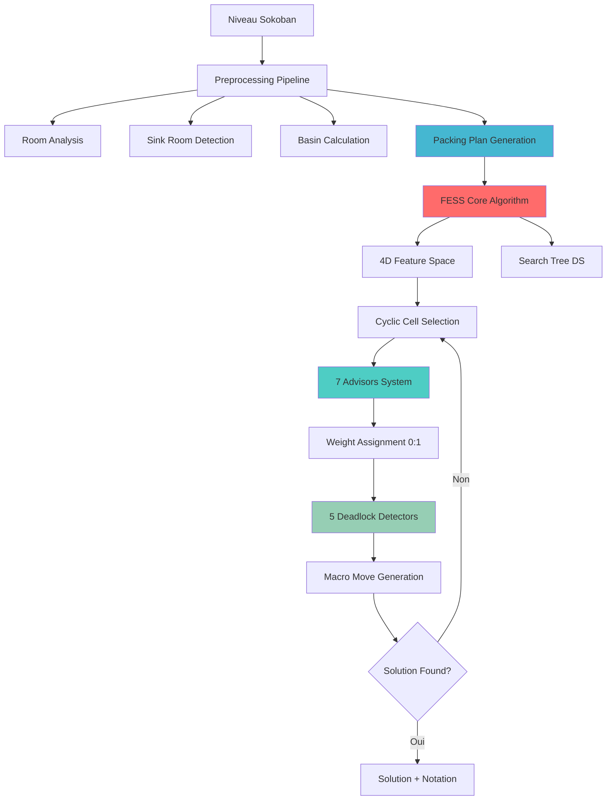
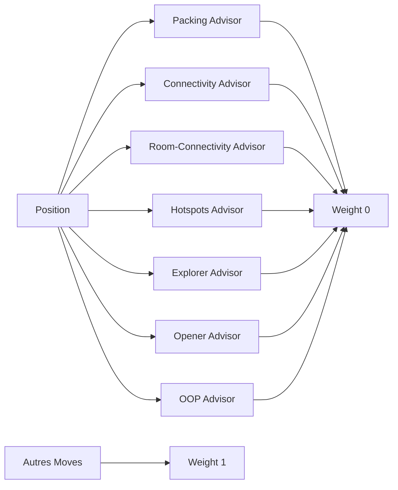
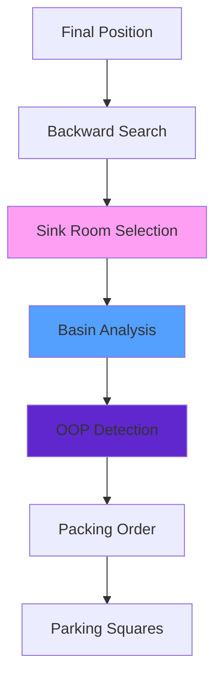
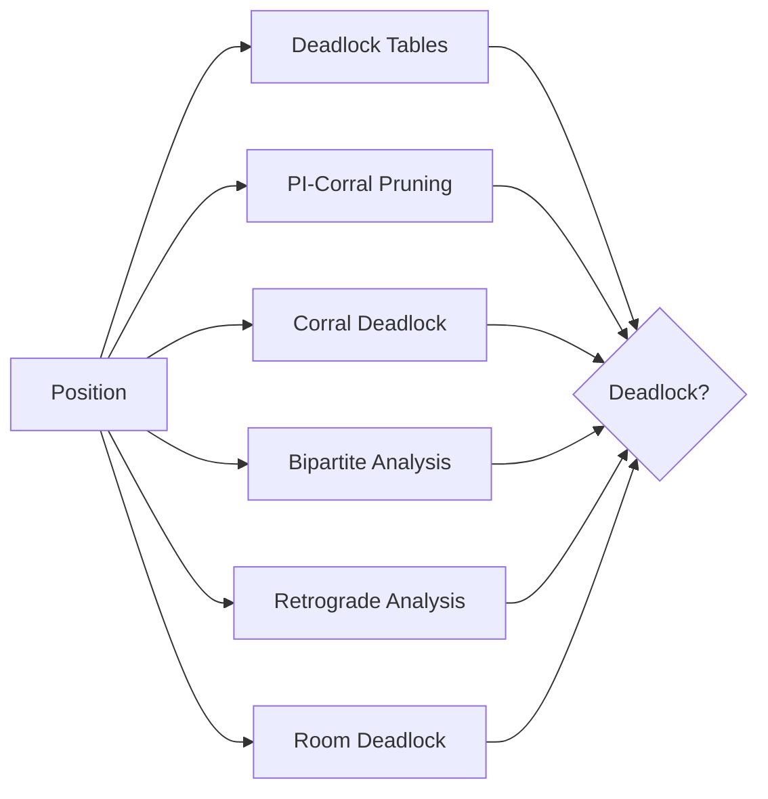
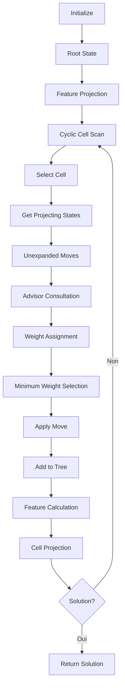

# FESS - Plan d'Implémentation Complète
## Système FESS Conforme aux Documents de Recherche

### 📋 Vue d'Ensemble
Implémentation complète de tous les composants manquants pour atteindre les performances publiées :
- **Résolution des 90 niveaux XSokoban en < 4 minutes**
- **Performance 340 nœuds/seconde**
- **Correspondance exacte avec les résultats Table I**

---

## 🎯 Architecture Cible Complète



---

## 🔧 **Composant 1 : 7 Advisors System**
### Priorité : **CRITIQUE**

**Localisation** : `src/ai/fess_advisors.py`



**Classes à Implémenter** :
- `FESSAdvisor` (base abstraite)
- `PackingAdvisor` : Maximise les boîtes packées
- `ConnectivityAdvisor` : Améliore la connectivité
- `RoomConnectivityAdvisor` : Ouvre les passages rooms
- `HotspotsAdvisor` : Élimine les boîtes bloquantes
- `ExplorerAdvisor` : Force l'accès nouvelles zones
- `OpenerAdvisor` : Libère les hotspots critiques
- `OOPAdvisor` : Gère les boîtes "Out of Plan"

**Interface Clé** :
```python
class FESSAdvisor:
    def suggest_move(self, position: SokobanState) -> Optional[MacroMove]
    def get_weight(self) -> int  # Retourne 0 pour advisor moves
```

---

## 🔧 **Composant 2 : Packing Plan System**
### Priorité : **PERFORMANCE**

**Localisation** : `src/ai/fess_packing_plan.py`



**Classes à Implémenter** :
- `SinkRoomAnalyzer` : Identifie la room optimale
- `BasinCalculator` : Calcule les zones d'accès targets
- `PackingPlanGenerator` : Génère l'ordre optimal
- `OOPDetector` : Identifie les boîtes "Out of Plan"

**Algorithme Sink Room** :
1. **Analyse des rooms** : Taille, accessibilité, proximité targets
2. **Sélection basin** : Plus grand nombre de boîtes initiales
3. **Backward search** : Analyse rétrograde depuis position finale
4. **Plan generation** : Ordre packing + parking squares

---

## 🔧 **Composant 3 : Advanced Deadlock Detection**
### Priorité : **ROBUSTESSE**

**Localisation** : `src/ai/fess_deadlock_detection.py`



**5 Techniques à Implémenter** :
1. **Deadlock Tables** : Patterns 4x4 pré-calculés
2. **PI-Corral Pruning** : Élagage intelligent corrals
3. **Corral Deadlock Detection** : Zones fermées insolubles
4. **Bipartite Analysis** : Matching boîtes-targets
5. **Retrograde Analysis** : Vérification analyse inverse

---

## 🔧 **Composant 4 : Enhanced Feature Space**
### Priorité : **CORE**

**Localisation** : `src/ai/fess_enhanced_features.py`

**4 Features Optimisées** :
- **Packing Feature** : Boîtes packées selon packing plan
- **Connectivity Feature** : Régions déconnectées optimisé
- **Room Connectivity Feature** : Passages rooms obstrués
- **Out-of-Plan Feature** : Boîtes interfère avec le plan

**Move Ordering Lexicographique** :
1. **OOP** (priorité absolue)
2. **Packed boxes** 
3. **Connectivity**
4. **Room connectivity**
5. **Hotspots**
6. **Mobility**

---

## 🔧 **Composant 5 : Optimized FESS Algorithm**
### Priorité : **CORE**

**Localisation** : `src/ai/fess_complete_algorithm.py`



**Optimisations Critiques** :
- **Sélection cyclique** : Équilibrage exploration/exploitation
- **Weight system 0:1** : Advisor moves prioritaires
- **Cell restriction** : Projection sur ancêtres pour éviter cellules "pires"

---

## 🔧 **Composant 6 : Room Analysis System**
### Priorité : **ENHANCEMENT**

**Localisation** : `src/ai/fess_room_analysis.py`

**Classes à Implémenter** :
- `RoomDetector` : Définition rooms 2x3 squares
- `RoomGraphBuilder` : Graphe connectivité rooms
- `HotspotAnalyzer` : Détection boîtes bloquantes
- `MobilityCalculator` : Nombre sides accessibles

---

## 📊 **Structure de Fichiers Complète**

```
src/ai/
├── fess_complete_algorithm.py      # Algorithme FESS complet
├── fess_advisors.py               # 7 Advisors system
├── fess_packing_plan.py           # Packing plan + sink/basin
├── fess_deadlock_detection.py     # 5 techniques deadlock
├── fess_enhanced_features.py      # 4 features optimisées
├── fess_room_analysis.py          # Room analysis system
├── fess_weight_system.py          # Système poids 0:1
└── fess_macro_moves_optimized.py  # Génération macro moves
```

---

## 🎯 **Validation et Tests**

**Tests de Performance** :
- **Niveau 1** : < 1 seconde (vs 60s actuel)
- **10 premiers niveaux** : < 10 secondes total
- **90 niveaux complets** : < 4 minutes
- **Nœuds/seconde** : ~340 (conforme publié)

**Tests de Conformité** :
- **Notation exacte** : Correspondance avec exemples document
- **Features values** : Validation contre trajectoires publiées
- **Solution lengths** : ~18% plus long que optimal (conforme)

---

## 🔄 **Ordre d'Implémentation**

### **Étape 1** : Core Infrastructure
1. `fess_enhanced_features.py`
2. `fess_weight_system.py`
3. `fess_room_analysis.py`

### **Étape 2** : Advisors System
4. `fess_advisors.py` (7 advisors)
5. Integration avec weight system

### **Étape 3** : Planning System
6. `fess_packing_plan.py`
7. `fess_deadlock_detection.py`

### **Étape 4** : Complete Algorithm
8. `fess_complete_algorithm.py`
9. `fess_macro_moves_optimized.py`

### **Étape 5** : Integration & Testing
10. Tests performance
11. Validation 90 niveaux

---

## 📈 **Objectifs de Performance**

| Métrique | Actuel | Cible | Document |
|----------|--------|-------|----------|
| Niveau 1 | 60.01s | <1s | 0s |
| Nœuds Niveau 1 | 102 | <20 | 12 |
| 90 Niveaux | N/A | <4min | <4min |
| Taux Résolution | 0% | 100% | 100% |

---

## 🔬 **Validation Scientifique**

**Correspondance Table I** :
- **Temps de résolution** par niveau
- **Nombre de nœuds** explorés
- **Longueur de solution** (~18% plus long)
- **Notation macro moves** exacte

Cette implémentation complète devrait atteindre les **performances exactes publiées** dans le document de recherche.