# PySokoban Architecture Diagram

The following diagram illustrates the architecture of the PySokoban project after refactoring:

```mermaid
graph TD
    %% Main entry points
    Main[main.py] --> Game[core/game.py]
    GuiMain[gui_main.py] --> Game
    EnhancedMain[enhanced_main.py] --> Game
    EditorMain[editor_main.py] --> Editors
    
    %% Core components
    Game --> Level[core/level.py]
    Game --> Constants[core/constants.py]
    
    %% Renderers
    Game --> TerminalRenderer[renderers/terminal_renderer.py]
    GuiMain --> GuiRenderer[renderers/gui_renderer.py]
    EnhancedMain --> GuiRenderer
    
    %% Level Management
    Game --> LevelManager[level_management/level_manager.py]
    LevelManager --> Level
    LevelManager --> LevelSelector[level_management/level_selector.py]
    LevelManager --> LevelMetrics[level_management/level_metrics.py]
    
    %% Editors
    Editors[editors/] --> Level
    Editors --> LevelManager
    Editors --> GuiRenderer
    
    %% UI Components
    EnhancedMain --> MenuSystem[ui/menu_system.py]
    MenuSystem --> Button[ui/button.py]
    MenuSystem --> SkinsMenu[ui/skins_menu.py]
    SkinsMenu --> SkinManager[ui/skins/skin_manager.py]
    SkinsMenu --> EnhancedSkinManager[ui/skins/enhanced_skin_manager.py]
    
    %% Generation
    LevelManager --> ProceduralGenerator[generation/procedural_generator.py]
    ProceduralGenerator --> LevelSolver[generation/level_solver.py]
    ProceduralGenerator --> AdvancedGeneration[generation/advanced/]
    
    %% Advanced Generation
    AdvancedGeneration --> AdvancedProceduralGenerator[generation/advanced/advanced_procedural_generator.py]
    AdvancedGeneration --> PatternBasedGenerator[generation/advanced/pattern_based_generator.py]
    AdvancedGeneration --> StyleTransferEngine[generation/advanced/style_transfer_engine.py]
    AdvancedGeneration --> LearningModels[generation/advanced/learning_models.py]
    AdvancedGeneration --> PlayerFeedbackAnalyzer[generation/advanced/player_feedback_analyzer.py]
    
    %% Data files
    Level --> LevelFiles[levels/]
    SkinManager --> SkinFiles[skins/]
    
    %% Tests
    Tests[tests/] --> Game
    Tests --> ProceduralGenerator
    Tests --> Editors
    
    %% Style
    classDef entryPoint fill:#f96,stroke:#333,stroke-width:2px;
    classDef core fill:#9cf,stroke:#333,stroke-width:2px;
    classDef ui fill:#fcf,stroke:#333,stroke-width:2px;
    classDef generation fill:#cfc,stroke:#333,stroke-width:2px;
    classDef data fill:#ccc,stroke:#333,stroke-width:1px;
    
    class Main,GuiMain,EnhancedMain,EditorMain entryPoint;
    class Game,Level,Constants core;
    class MenuSystem,Button,SkinsMenu,SkinManager,EnhancedSkinManager,GuiRenderer,TerminalRenderer ui;
    class ProceduralGenerator,LevelSolver,AdvancedGeneration,AdvancedProceduralGenerator,PatternBasedGenerator,StyleTransferEngine,LearningModels,PlayerFeedbackAnalyzer generation;
    class LevelFiles,SkinFiles data;
```

## Component Descriptions

### Entry Points
- **main.py**: Terminal version of the game
- **gui_main.py**: GUI version of the game
- **enhanced_main.py**: Enhanced version with additional features
- **editor_main.py**: Entry point for level editors

### Core Components
- **core/game.py**: Main game logic
- **core/level.py**: Level representation and mechanics
- **core/constants.py**: Game constants and configuration

### Renderers
- **renderers/terminal_renderer.py**: Terminal-based renderer
- **renderers/gui_renderer.py**: GUI renderer using pygame

### Level Management
- **level_management/level_manager.py**: Manages loading and switching levels
- **level_management/level_selector.py**: UI for selecting levels
- **level_management/level_metrics.py**: Metrics for level difficulty analysis

### Editors
- **editors/level_editor.py**: Basic level editor
- **editors/enhanced_level_editor.py**: Enhanced level editor
- **editors/graphical_level_editor.py**: Graphical level editor

### UI Components
- **ui/menu_system.py**: Menu system for the enhanced version
- **ui/button.py**: Button UI component
- **ui/skins_menu.py**: Menu for selecting skins
- **ui/skins/skin_manager.py**: Basic skin manager
- **ui/skins/enhanced_skin_manager.py**: Enhanced skin manager

### Generation
- **generation/procedural_generator.py**: Procedural level generator
- **generation/level_solver.py**: Level solver for validation
- **generation/advanced/**: Advanced generation components