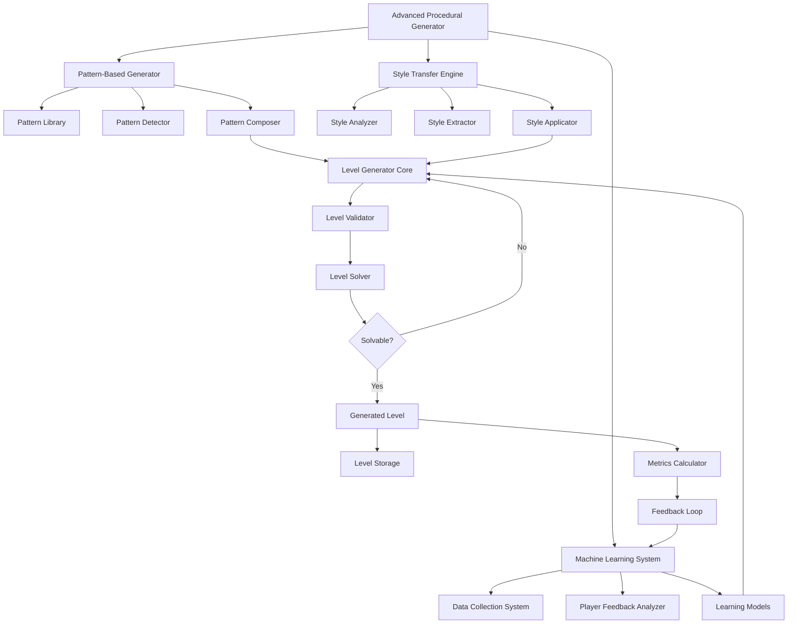

# Advanced Procedural Generation System for Sokoban - Implementation Plan

## 1. System Architecture Overview



## 2. Implementation Plan for Each Component

### 2.1. Pattern-Based Generation

1. **Pattern Library Development**
   - Create a database structure to store both puzzle patterns (box-wall configurations) and structural patterns (room layouts, corridors)
   - Implement pattern categorization by difficulty, size, and purpose
   - Develop a pattern query system to retrieve appropriate patterns based on generation parameters

2. **Pattern Detection System**
   - Implement algorithms to identify common Sokoban puzzle patterns in existing levels
   - Develop structural analysis to detect room layouts, corridors, and connectivity patterns
   - Create a system to extract and normalize detected patterns for storage

3. **Pattern Composition Engine**
   - Develop algorithms to combine puzzle patterns within structural frameworks
   - Implement constraint-based placement to ensure patterns work together coherently
   - Create transition generators to connect different pattern elements seamlessly

### 2.2. Style Transfer System

1. **Style Analysis Framework**
   - Implement metrics to quantify style characteristics (wall density, symmetry, space utilization)
   - Develop algorithms to detect aesthetic patterns and design principles
   - Create a style profile representation that captures the essence of a level's design

2. **Style Extraction Pipeline**
   - Develop statistical methods to extract style parameters from analysis results
   - Implement feature extraction to identify distinctive style elements
   - Create normalization techniques to make style parameters applicable to different level sizes

3. **Style Application System**
   - Implement transformation algorithms to apply style parameters to level structures
   - Develop constraint-based modification to preserve puzzle integrity while applying style
   - Create validation methods to ensure style application doesn't break level solvability

### 2.3. Machine Learning System

1. **Data Collection Framework**
   - Design a player feedback collection UI integrated into the game
   - Implement storage for level data, generation parameters, and player feedback
   - Create data preprocessing pipelines to prepare collected data for learning

2. **Hybrid Learning Models**
   - Implement statistical models for pattern effectiveness evaluation
   - Develop neural networks for style preference prediction and difficulty estimation
   - Create reinforcement learning components for optimizing generation parameters

3. **Feedback Integration System**
   - Implement continuous learning from player feedback
   - Develop adaptive generation parameter adjustment based on learning outcomes
   - Create evaluation metrics to measure improvement over time

## 3. Integration Strategy

1. **Unified Generation Pipeline**
   - Develop an orchestration layer that coordinates all three subsystems
   - Implement parameter merging to combine inputs from all three approaches
   - Create fallback mechanisms to ensure generation succeeds even if some subsystems fail

2. **UI Integration**
   - Extend the existing level editor with advanced generation controls
   - Implement feedback collection UI components
   - Create visualization tools for generation parameters and metrics

3. **Evaluation and Tuning Framework**
   - Develop comprehensive metrics for evaluating generated levels
   - Implement A/B testing capabilities to compare different generation approaches
   - Create parameter tuning tools for optimizing generation results

## 4. Implementation Phases

### Phase 1: Foundation (1-2 months)
- Implement basic pattern library and detection
- Develop core style analysis and extraction
- Create data collection framework
- Extend existing generator with new architecture

### Phase 2: Core Features (2-3 months)
- Implement pattern composition engine
- Develop style application system
- Create basic statistical learning models
- Integrate all three subsystems with the core generator

### Phase 3: Advanced Features (3-4 months)
- Implement neural network models for style and difficulty
- Develop reinforcement learning for parameter optimization
- Create comprehensive feedback integration
- Implement advanced visualization and tuning tools

### Phase 4: Refinement (1-2 months)
- Optimize performance and resource usage
- Refine user interfaces for generation and feedback
- Conduct extensive testing and parameter tuning
- Document the system and create tutorials

## 5. Technical Considerations

1. **Performance Optimization**
   - Implement caching for pattern detection and style analysis
   - Use efficient algorithms for pattern matching and composition
   - Optimize machine learning inference for real-time use

2. **Extensibility**
   - Design modular interfaces for all components
   - Implement plugin architecture for adding new patterns and style elements
   - Create configuration system for easy parameter tuning

3. **Robustness**
   - Implement comprehensive error handling and fallback mechanisms
   - Create validation at each step to ensure level integrity
   - Develop monitoring tools to track system performance and learning progress

## 6. Detailed Component Specifications

### 6.1. Advanced Procedural Generator

The central orchestration module that integrates all three approaches:

```python
class AdvancedProceduralGenerator:
    def __init__(self, config=None):
        # Initialize sub-systems
        self.pattern_generator = PatternBasedGenerator(config.get('pattern', {}))
        self.style_transfer = StyleTransferEngine(config.get('style', {}))
        self.ml_system = MachineLearningSystem(config.get('ml', {}))
        
        # Initialize core components
        self.level_generator = LevelGeneratorCore()
        self.validator = LevelValidator()
        self.solver = SokobanSolver()
        
    def generate_level(self, parameters=None):
        # Get pattern templates from pattern-based generator
        patterns = self.pattern_generator.get_patterns(parameters)
        
        # Get style parameters from style transfer engine
        style_params = self.style_transfer.get_style_parameters(parameters)
        
        # Get learning-based adjustments from ML system
        ml_adjustments = self.ml_system.get_generation_parameters(parameters)
        
        # Combine all inputs for the core generator
        generation_params = self._combine_parameters(patterns, style_params, ml_adjustments)
        
        # Generate level with integrated parameters
        level = self._generate_with_parameters(generation_params)
        
        # Record generation for learning
        self.ml_system.record_generation(level, self.metrics.calculate_metrics(level), generation_params)
        
        return level
```

### 6.2. Pattern Library

Storage and management for both puzzle patterns and structural patterns:

```python
class PatternLibrary:
    def __init__(self):
        self.puzzle_patterns = []  # Specific box-wall configurations
        self.structural_patterns = []  # Room layouts, corridors, etc.
        
    def add_pattern(self, pattern, pattern_type, metadata=None):
        if pattern_type == 'puzzle':
            self.puzzle_patterns.append({
                'pattern': pattern,
                'metadata': metadata or {}
            })
        elif pattern_type == 'structural':
            self.structural_patterns.append({
                'pattern': pattern,
                'metadata': metadata or {}
            })
            
    def select_patterns(self, params):
        # Select appropriate patterns based on parameters
        # (difficulty, size, etc.)
```

### 6.3. Style Analyzer

Analysis of level style characteristics:

```python
class StyleAnalyzer:
    def analyze(self, level):
        # Analyze wall density and distribution
        wall_analysis = self._analyze_walls(level)
        
        # Analyze open space characteristics
        space_analysis = self._analyze_spaces(level)
        
        # Analyze box and target placement
        object_analysis = self._analyze_objects(level)
        
        # Analyze symmetry and balance
        symmetry_analysis = self._analyze_symmetry(level)
        
        return {
            'walls': wall_analysis,
            'spaces': space_analysis,
            'objects': object_analysis,
            'symmetry': symmetry_analysis
        }
```

### 6.4. Data Collection System

Collection and storage of player data and feedback:

```python
class DataCollectionSystem:
    def __init__(self):
        self.generations_db = {}  # Store generated levels and their metrics
        self.feedback_db = {}     # Store player feedback
        
    def record_generation(self, level, metrics, generation_params):
        level_id = self._generate_level_id(level)
        self.generations_db[level_id] = {
            'level': level,
            'metrics': metrics,
            'generation_params': generation_params,
            'timestamp': time.time()
        }
        
    def record_feedback(self, level_id, feedback_data):
        if level_id not in self.feedback_db:
            self.feedback_db[level_id] = []
            
        self.feedback_db[level_id].append({
            'feedback': feedback_data,
            'timestamp': time.time()
        })
```

### 6.5. Feedback Collection UI

UI component for collecting player feedback:

```python
class FeedbackCollectionUI:
    def __init__(self, screen, ml_system):
        self.screen = screen
        self.ml_system = ml_system
        self.visible = False
        self.current_level_id = None
        
    def show(self, level_id):
        self.visible = True
        self.current_level_id = level_id
        self._create_ui_elements()
        
    def submit_feedback(self):
        feedback_data = {
            'difficulty_rating': self._get_difficulty_rating(),
            'enjoyment_rating': self._get_enjoyment_rating(),
            'completion_time': self._get_completion_time(),
            'move_count': self._get_move_count(),
            'comments': self._get_comments()
        }
        
        # Send feedback to ML system
        self.ml_system.record_player_feedback(self.current_level_id, feedback_data)
```

## 7. Integration with Existing Code

### 7.1. Enhanced Procedural Generator

Extension of the existing `ProceduralGenerator` class:

```python
class EnhancedProceduralGenerator(ProceduralGenerator):
    def __init__(self, min_width=7, max_width=15, min_height=7, max_height=15,
                 min_boxes=1, max_boxes=5, wall_density=0.2, timeout=30,
                 advanced_config=None):
        # Initialize the base generator
        super().__init__(min_width, max_width, min_height, max_height,
                        min_boxes, max_boxes, wall_density, timeout)
        
        # Initialize advanced generator
        self.advanced_generator = AdvancedProceduralGenerator(advanced_config)
        
        # Flag to control whether to use advanced generation
        self.use_advanced = True
        
    def generate_level(self):
        if not self.use_advanced:
            # Use the original generation method
            return super().generate_level()
            
        # Use the advanced generation method
        try:
            # Convert basic parameters to advanced parameters
            params = {
                'min_width': self.min_width,
                'max_width': self.max_width,
                'min_height': self.min_height,
                'max_height': self.max_height,
                'min_boxes': self.min_boxes,
                'max_boxes': self.max_boxes,
                'wall_density': self.wall_density,
                'timeout': self.timeout
            }
            
            # Generate level using advanced generator
            return self.advanced_generator.generate_level(params)
            
        except Exception as e:
            print(f"Advanced generation failed: {e}")
            print("Falling back to basic generation...")
            self.use_advanced = False
            return super().generate_level()
```

## 8. Testing and Evaluation Strategy

1. **Unit Testing**
   - Test each component individually with mock inputs
   - Verify pattern detection accuracy with known patterns
   - Validate style extraction and application with reference levels

2. **Integration Testing**
   - Test the interaction between subsystems
   - Verify that combined parameters produce valid levels
   - Ensure fallback mechanisms work correctly

3. **Performance Testing**
   - Measure generation time with different parameters
   - Evaluate memory usage during generation
   - Test scalability with increasing complexity

4. **User Testing**
   - Collect feedback on generated levels from players
   - Compare player ratings of basic vs. advanced generation
   - Evaluate the effectiveness of the feedback collection system

## 9. Future Extensions

1. **Advanced Pattern Learning**
   - Implement automatic pattern discovery from player-created levels
   - Develop pattern evolution through genetic algorithms
   - Create a community pattern sharing system

2. **Multi-objective Optimization**
   - Implement Pareto optimization for balancing multiple objectives
   - Develop personalized difficulty curves for players
   - Create adaptive generation based on player skill progression

3. **Cross-game Style Transfer**
   - Extend style transfer to work across different puzzle games
   - Develop abstract style representations that transcend specific game mechanics
   - Create a unified style library for multiple games