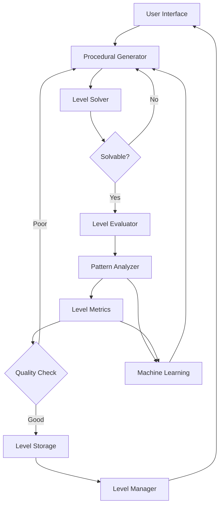
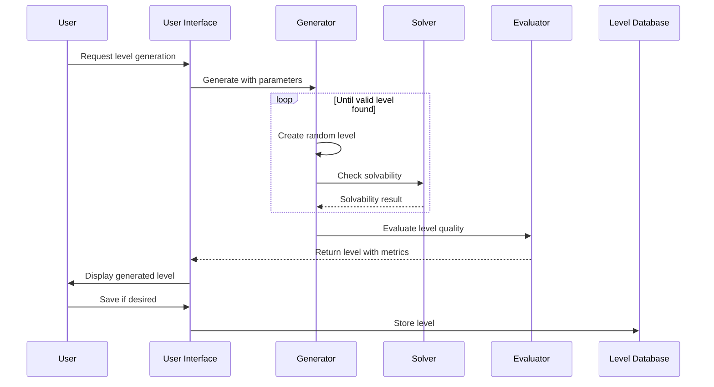

Based on the files I've examined, I now have a good understanding of the Sokoban game's structure:

1. The game is implemented in Python with both terminal and GUI interfaces.
2. The core game logic is in the `Level` class, which handles level representation, player movement, and game state.
3. The `LevelManager` class manages multiple levels, loading them from files, and tracking the current level.
4. The game has both a terminal-based level editor (`LevelEditor`) and a graphical level editor (`GraphicalLevelEditor`).
5. Levels are stored as text files with simple ASCII characters representing walls, floors, players, boxes, and targets.

Now, let's think about how to implement the procedural level generation feature requested by the user. Based on the Reddit thread, the user wants:

1. Random level generation that produces solvable levels
2. A way to test these levels on the fly
3. A system to discover interesting patterns and improve level design
4. Potentially an AI that can learn and improve over time

To implement this, I'll need to create:

1. A procedural level generator that can create random levels
2. A solver to verify that generated levels are solvable
3. A system to evaluate the quality/interestingness of levels
4. A way to integrate this into the existing level editor
5. Potentially a machine learning component to improve generation over time

Let me plan out the architecture for this feature:

Now that I've examined the key files in your Sokoban game, I have a good understanding of how your game works. Let me outline a plan for implementing the procedural level generation feature based on the Reddit thread you shared.

# Procedural Level Generation for Sokoban - Implementation Plan

## 1. Overview

The goal is to add a procedural level generation system to your Sokoban game that can:
- Generate random levels that are guaranteed to be solvable
- Allow testing these levels on the fly
- Discover interesting patterns and improve level design over time
- Use AI/algorithms to learn what makes a good level

## 2. Core Components

### 2.1 Level Generator
A module that creates random Sokoban levels based on configurable parameters:
- Level size (width, height)
- Number of boxes/targets
- Wall density
- Special patterns to include

### 2.2 Level Solver
A module that can determine if a generated level is solvable:
- Implement a search algorithm (A*, BFS, etc.) to find solutions
- Track dead-end states to avoid them in future generations
- Calculate solution difficulty (moves, pushes, complexity)

### 2.3 Level Evaluator
A system to evaluate the quality and interestingness of levels:
- Solution length
- Number of interesting moves (box arrangements, tricky pushes)
- Aesthetic patterns
- Difficulty curve

### 2.4 Pattern Recognizer
A component to identify and learn interesting patterns:
- Detect common box arrangements
- Identify challenging configurations
- Learn from player solutions

### 2.5 UI Integration
Integration with your existing level editors:
- Add procedural generation options to both terminal and graphical editors
- Allow fine-tuning of generation parameters
- Provide visualization of the generation process

## 3. Technical Implementation

### 3.1 New Modules

#### `procedural_generator.py`
- Main class for generating random levels
- Configuration options for level parameters
- Integration with solver to ensure solvability

#### `level_solver.py`
- Implements algorithms to solve Sokoban levels
- Provides metrics on solution difficulty
- Can work in reverse to create levels from solutions

#### `pattern_analyzer.py`
- Identifies patterns in levels and solutions
- Stores and categorizes interesting patterns
- Provides feedback to the generator

#### `level_metrics.py`
- Calculates various metrics for level quality
- Helps rank and filter generated levels
- Provides insights for improving generation

### 3.2 Integration Points

#### Graphical Level Editor
- Add a "Generate" button to the editor
- Create a dialog for generation parameters
- Allow browsing through generated levels

#### Level Manager
- Add methods to store and manage generated levels
- Provide filtering and sorting of levels by metrics
- Allow saving particularly good generated levels

## 4. Algorithm Approaches

### 4.1 Generation Methods

1. **Pure Random Generation + Validation**
   - Generate completely random levels
   - Check if they're solvable
   - Keep only the solvable ones

2. **Reverse Engineering**
   - Start with a solved state
   - Apply random valid moves in reverse
   - Ensure the level remains interesting

3. **Pattern-Based Generation**
   - Use a library of known interesting patterns
   - Combine patterns to create complete levels
   - Ensure connectivity and solvability

4. **Evolutionary Approach**
   - Generate a population of levels
   - Evaluate them based on metrics
   - Keep the best ones and create variations
   - Repeat over multiple generations

### 4.2 Solver Algorithms

1. **Breadth-First Search (BFS)**
   - Complete but can be memory-intensive
   - Good for finding shortest solutions

2. **A* Search**
   - More efficient for larger levels
   - Requires good heuristics for Sokoban

3. **Monte Carlo Tree Search**
   - Good for exploring solution spaces
   - Can find interesting solutions

## 5. Machine Learning Integration

### 5.1 Learning Components

1. **Pattern Recognition**
   - Learn what patterns make levels interesting
   - Identify difficulty factors

2. **Difficulty Estimation**
   - Predict how difficult a level will be
   - Balance challenge and solvability

3. **Style Transfer**
   - Learn from existing well-designed levels
   - Apply similar design principles to new levels

### 5.2 Implementation Options

1. **Simple Statistical Learning**
   - Track metrics across many levels
   - Use statistical models to predict quality

2. **Neural Networks**
   - Train on existing levels and solutions
   - Generate new levels with similar properties

3. **Reinforcement Learning**
   - Use player feedback to improve generation
   - Reward system for creating engaging levels

## 6. Development Phases

### Phase 1: Basic Generation
- Implement random generation with validation
- Add simple UI integration
- Allow testing of generated levels

### Phase 2: Enhanced Generation
- Add pattern-based generation
- Implement metrics for level quality
- Improve solver efficiency

### Phase 3: Learning & Optimization
- Add pattern recognition
- Implement statistical learning
- Create feedback loop for improvement

### Phase 4: Advanced Features
- Add full machine learning integration
- Implement style transfer from existing levels
- Create a level recommendation system

## 7. Mermaid Diagram of System Architecture

## 8. Mermaid Diagram of Generation Process

Would you like me to proceed with implementing any specific part of this plan, or would you like to discuss any aspects in more detail?

It seems the user has selected all four options as important to them. This means they want:

The ability to quickly generate many random solvable levels to discover interesting patterns
A sophisticated AI system that learns from existing levels and player solutions to create increasingly better levels
Fine-grained control over generation parameters (size, difficulty, number of boxes, etc.) to create levels with specific characteristics
Integration with the existing level editor to easily test, modify, and save generated levels
This is quite comprehensive and will require a substantial implementation. Let me ask another question to understand their priorities for the initial implementation, since we might want to take a phased approach.

I see you're interested in all aspects of the procedural generation system. Let me ask one more question to help prioritize the implementation:

Start with basic random generation + solver to quickly produce many solvable levels, then add the AI learning system later
Focus first on the parameter controls and editor integration for a solid foundation, then add more sophisticated generation methods
Begin with the AI/machine learning system as the core, even if it takes longer to implement initially
Implement a minimal version of all components first, then enhance each one incrementally
