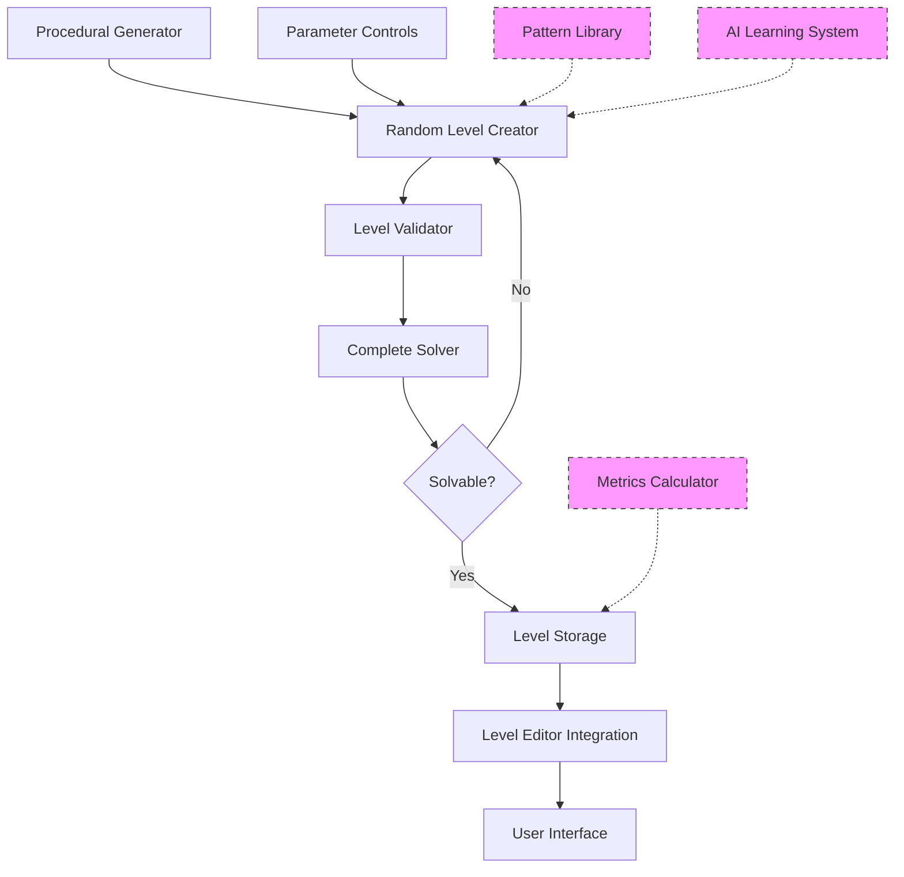

# Procedural Level Generation System for Sokoban - Implementation Plan

## 1. System Architecture



## 2. Core Components

### 2.1. Procedural Generator Module (`procedural_generator.py`)

This will be the main module that orchestrates the level generation process:

```python
class ProceduralGenerator:
    def __init__(self, min_width=7, max_width=15, min_height=7, max_height=15, 
                 min_boxes=1, max_boxes=10, wall_density=0.3):
        self.min_width = min_width
        self.max_width = max_width
        self.min_height = min_height
        self.max_height = max_height
        self.min_boxes = min_boxes
        self.max_boxes = max_boxes
        self.wall_density = wall_density
        self.solver = SokobanSolver()
        
    def generate_level(self):
        """Generate a random solvable level based on parameters"""
        while True:
            level = self._create_random_level()
            if self._validate_level(level):
                if self.solver.is_solvable(level):
                    return level
    
    def _create_random_level(self):
        """Create a random level with walls, player, boxes and targets"""
        # Implementation details...
        
    def _validate_level(self, level):
        """Perform basic validation on the level"""
        # Check if level has basic requirements (player, boxes, targets)
        # Check if boxes and targets match in number
        # Check if level is connected (no unreachable areas)
```

### 2.2. Sokoban Solver (`level_solver.py`)

A complete solver that guarantees to find a solution if one exists:

```python
class SokobanSolver:
    def __init__(self):
        self.visited_states = set()
        
    def is_solvable(self, level):
        """Check if the level is solvable"""
        return self._solve(level) is not None
        
    def _solve(self, level):
        """Find a solution for the level using breadth-first search"""
        # Implementation of BFS algorithm
        # Track visited states to avoid cycles
        # Return solution path if found, None otherwise
        
    def _get_state_hash(self, level):
        """Create a hash of the current level state for tracking visited states"""
        # Create a unique representation of the level state
        
    def _is_deadlock(self, level):
        """Check if the level is in a deadlock state"""
        # Implement deadlock detection rules
        # (e.g., box in corner, box against wall with no target, etc.)
```

### 2.3. Level Metrics Calculator (`level_metrics.py`)

For evaluating the quality and difficulty of generated levels:

```python
class LevelMetrics:
    def __init__(self):
        pass
        
    def calculate_metrics(self, level, solution=None):
        """Calculate various metrics for a level"""
        metrics = {
            'size': self._calculate_size(level),
            'box_count': len(level.boxes),
            'solution_length': len(solution) if solution else None,
            'difficulty': self._estimate_difficulty(level),
            'patterns': self._identify_patterns(level),
        }
        return metrics
        
    def _calculate_size(self, level):
        """Calculate the effective size of the level"""
        # Implementation...
        
    def _estimate_difficulty(self, level):
        """Estimate the difficulty of the level"""
        # Implementation...
        
    def _identify_patterns(self, level):
        """Identify interesting patterns in the level"""
        # Implementation...
```

### 2.4. UI Integration

#### 2.4.1. Graphical Level Editor Integration

Add generation controls to the existing graphical editor:

```python
# In graphical_level_editor.py

def _create_buttons(self):
    # Existing code...
    
    # Add generate button
    self.buttons.append({
        'rect': pygame.Rect(20 + (button_width + button_spacing) * 7, button_y, button_width, button_height),
        'text': 'Generate', 'action': self._show_generate_dialog
    })

def _show_generate_dialog(self):
    """Show dialog to configure and generate a level"""
    # Implementation of a dialog with generation parameters
    # Call the procedural generator with the parameters
    # Load the generated level into the editor
```

#### 2.4.2. Terminal Level Editor Integration

Add generation options to the terminal editor:

```python
# In level_editor.py

def _show_welcome_screen(self):
    # Existing code...
    print("1. Create new level")
    print("2. Edit existing level")
    print("3. Generate random level")  # New option
    print("4. Exit")
    
    # Update the choice handling code
    if choice == '3':
        self._generate_random_level()
```

## 3. Implementation Phases

### Phase 1: Core Generation System

1. Create the `procedural_generator.py` module with basic random level generation
2. Implement the `level_solver.py` module with a complete BFS-based solver
3. Add basic level validation to ensure generated levels meet requirements
4. Create simple integration with both editors to generate and test levels

### Phase 2: Enhanced Generation and Metrics

1. Implement the `level_metrics.py` module to evaluate generated levels
2. Add more sophisticated generation techniques (e.g., reverse engineering from solved states)
3. Improve the solver with deadlock detection and optimization
4. Enhance the UI with more generation parameters and metrics display

### Phase 3: Pattern Recognition and Learning (Future)

1. Implement pattern recognition to identify interesting level features
2. Create a pattern library to store and categorize discovered patterns
3. Add statistical analysis of level characteristics and solutions
4. Begin implementing basic machine learning for level improvement

### Phase 4: Advanced AI System (Future)

1. Develop a full AI learning system that improves over time
2. Implement style transfer from existing well-designed levels
3. Create a feedback loop from player solutions to generation
4. Add a recommendation system for levels based on player preferences

## 4. Technical Considerations

### 4.1. Solver Algorithm

For the complete solver, we'll use a breadth-first search (BFS) approach:

1. Start with the initial state
2. Explore all possible moves (up, down, left, right)
3. For each valid move, create a new state
4. Check if the new state is a solution
5. If not, add it to the queue of states to explore
6. Continue until a solution is found or all states are explored

To optimize this process:
- Use a hash function to track visited states
- Implement deadlock detection to prune the search tree
- Use a priority queue to explore more promising states first

### 4.2. Random Level Generation

The basic approach for random level generation:

1. Create a grid of the desired size
2. Add walls around the perimeter
3. Randomly place internal walls based on wall density
4. Ensure the level is connected (all floor tiles are reachable)
5. Place the player at a random position
6. Place boxes and targets at random positions
7. Validate the level meets basic requirements

### 4.3. Level Validation

Basic validation checks:
- Level has exactly one player
- Number of boxes equals number of targets
- All floor tiles are connected (no unreachable areas)
- No obvious deadlocks (boxes in corners without targets)

## 5. File Structure

```
sokoban/
├── procedural_generator.py  # Main generation module
├── level_solver.py          # Solver implementation
├── level_metrics.py         # Metrics calculation
├── pattern_analyzer.py      # (Future) Pattern recognition
├── ai_learning.py           # (Future) AI learning system
└── ui/
    ├── generation_dialog.py # UI components for generation
```

## 6. Integration with Existing Code

### 6.1. Level Manager Integration

Add methods to the `LevelManager` class to handle generated levels:

```python
# In level_manager.py

def generate_random_level(self, params=None):
    """Generate a random level and load it"""
    generator = ProceduralGenerator(**(params or {}))
    level_data = generator.generate_level()
    self.current_level = Level(level_data=level_data)
    self.current_level_index = -1  # Indicate this is not from a file
    return True
    
def save_generated_level(self, filename):
    """Save the current generated level to a file"""
    if self.current_level:
        return self.create_custom_level(
            self.current_level.get_state_string(), 
            filename
        )
    return False
```

### 6.2. UI Integration

For both the terminal and graphical editors, we'll add:
- Options to generate random levels
- Controls to configure generation parameters
- Ability to save generated levels
- Display of level metrics and solution information

## 7. Testing Strategy

1. Unit tests for the solver to ensure it correctly identifies solvable and unsolvable levels
2. Tests for the random generator to verify it produces valid levels
3. Integration tests to ensure the generator and solver work together correctly
4. Performance tests to measure generation speed and solver efficiency